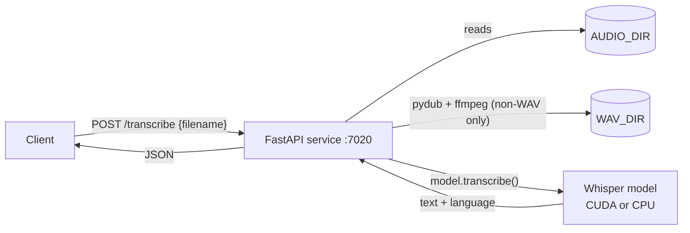

# Whisper Transcription Service

A small FastAPI microservice that turns speech into text with [OpenAI Whisper](https://github.com/openai/whisper), running **locally** (no cloud API, no API key). You give it the name of an audio file that already sits in a shared directory. It converts the file to WAV if needed, transcribes it, and returns the text plus the detected language.

It is meant to sit next to other services (for example a chat bot or an automation workflow) that save voice messages to disk and need them transcribed.

## Table of Contents

- [Features](#features)
- [How It Works](#how-it-works)
- [Requirements](#requirements)
- [Installation](#installation)
- [Configuration](#configuration)
- [API Reference](#api-reference)
- [Supported Audio Formats](#supported-audio-formats)
- [Model Sizes](#model-sizes)
- [Troubleshooting](#troubleshooting)
- [Security Notes](#security-notes)
- [Development](#development)
- [Contributing](#contributing)
- [License](#license)

## Features

- Local speech-to-text with the open-source `openai-whisper` package. Audio never leaves the machine.
- A single JSON endpoint, `POST /transcribe`, that takes a file name and returns `text` and `language`.
- Automatic language detection (Whisper's built-in detection; no language parameter).
- Accepts MP3, WAV, OGG, M4A, WEBM and OGA. Non-WAV files are converted to WAV with pydub and ffmpeg.
- Configurable Whisper model size through `WHISPER_MODEL` (default `base`).
- Uses the GPU (CUDA) automatically when PyTorch detects one, otherwise the CPU.
- Logs to stdout with Loguru, with a configurable level.
- Dockerfile included (`python:3.12-slim` with ffmpeg).

## How It Works



1. **Startup.** The service creates `WAV_DIR` if it does not exist, picks `cuda` when `torch.cuda.is_available()` is true (otherwise `cpu`), and loads the Whisper model named by `WHISPER_MODEL`. The model is loaded once and kept in memory. On first start the `openai-whisper` package downloads the model weights (by default to `~/.cache/whisper`).
2. **Request.** The client sends the **file name** (not the file itself). The service joins it with `AUDIO_DIR` and returns `404` if the file does not exist.
3. **Format check.** The extension (case-insensitive) must be one of the supported formats, otherwise `400`.
4. **Conversion.** A non-WAV file is converted to `WAV_DIR/<name>.wav`. A `.wav` file is transcribed in place.
5. **Transcription.** Whisper transcribes the WAV file and the service returns `{"text": ..., "language": ...}`.

The service does not accept uploads. The client and the service must share the audio directory, for example through a Docker volume.

## Requirements

- **Python 3.12** (the version the Dockerfile uses) for running from source.
- **ffmpeg** on the `PATH`. pydub uses it for conversion and Whisper uses it to read audio.
- **PyTorch** and **openai-whisper** (installed from `requirements.txt`).
- **Resources:** Whisper runs locally, so memory and speed depend on the model size (see [Model Sizes](#model-sizes)). A CUDA GPU is optional but makes transcription much faster; on CPU the larger models are slow.
- **Disk:** space for PyTorch (several GB for the default Linux wheels, which bundle CUDA libraries) and for the model weights (from tens of MB for `tiny` to several GB for `large`).
- **Network access on first start**, so Whisper can download the model weights.

## Installation

There are no published releases or Docker images. Build it yourself with one of the methods below.

### Docker

Build the image:

```bash
git clone https://github.com/t0mer/transcribing-service.git
cd transcribing-service
docker build -t whisper-transcription-service .
```

Run it, mounting your audio directory and a directory for the converted WAV files:

```bash
docker run -d --name whisper \
  -p 7020:7020 \
  -v /path/to/audio:/app/audio \
  -v /path/to/wav:/app/wav \
  -e WHISPER_MODEL=base \
  whisper-transcription-service
```

Notes on the image:

- The image sets `AUDIO_DIR=/app/audio` and `WAV_DIR=/app/wav`, so mount your volumes there (or override the variables).
- The model is **not** baked into the image. It is downloaded when the container starts and stored inside the container at `/root/.cache/whisper`. To avoid downloading it again every time the container is recreated, mount a volume there, for example `-v whisper-cache:/root/.cache/whisper`.
- `requirements.txt` does not pin a CPU-only PyTorch build, so on x86_64 Linux pip installs the default PyTorch wheel with its CUDA dependencies. Expect an image of several GB.
- To use an NVIDIA GPU, run the container with `--gpus all` on a host that has the NVIDIA Container Toolkit. <!-- TODO: verify GPU use inside the python:3.12-slim image -->
- The Dockerfile has no `EXPOSE` line; publish the port with `-p 7020:7020` as shown.

### From Source

```bash
git clone https://github.com/t0mer/transcribing-service.git
cd transcribing-service
python3.12 -m venv .venv
source .venv/bin/activate
pip install -r requirements.txt
```

Install ffmpeg (for example `sudo apt-get install ffmpeg` on Debian/Ubuntu), then start the service. Outside Docker the default directories are `/data/audio` and `/data/wav`, so set them to paths you can write to:

```bash
export AUDIO_DIR=$PWD/audio
export WAV_DIR=$PWD/wav
export WHISPER_MODEL=base
python app/app.py
```

The service listens on `http://0.0.0.0:7020`.

## Configuration

All configuration is through environment variables. The host (`0.0.0.0`) and port (`7020`) are hard-coded in `app/app.py`.

| Variable | Default (code) | Default (Docker image) | Description |
|---|---|---|---|
| `AUDIO_DIR` | `/data/audio` | `/app/audio` | Directory that contains the source audio files. The `filename` in each request is resolved relative to it. |
| `WAV_DIR` | `/data/wav` | `/app/wav` | Directory for the WAV files produced by conversion. Created at startup if missing. |
| `WHISPER_MODEL` | `base` | `base` | Whisper model name passed to `whisper.load_model()`, such as `tiny`, `base`, `small`, `medium` or `large`. Any name the installed `openai-whisper` version accepts will work. |
| `LOG_LEVEL` | `INFO` | `INFO` | Loguru log level (`TRACE`, `DEBUG`, `INFO`, `SUCCESS`, `WARNING`, `ERROR`, `CRITICAL`). |

There are no API keys: the model runs locally.

## API Reference

Base URL: `http://<host>:7020`. FastAPI also serves interactive documentation at `/docs` (Swagger UI), `/redoc`, and the schema at `/openapi.json`.

### `POST /transcribe`

Transcribes a file that already exists in `AUDIO_DIR`.

**Request body** (`application/json`):

| Field | Type | Required | Description |
|---|---|---|---|
| `filename` | string | yes | File name relative to `AUDIO_DIR`, including the extension. |

**Example:**

```bash
curl -X POST http://localhost:7020/transcribe \
  -H "Content-Type: application/json" \
  -d '{"filename": "example.mp3"}'
```

**Response `200`:**

```json
{
  "text": " Transcribed text content...",
  "language": "en"
}
```

`language` is the language code detected by Whisper. `text` is Whisper's raw output, which usually starts with a space.

**Errors** (FastAPI format, `{"detail": ...}`):

| Status | `detail` | Cause |
|---|---|---|
| `404` | `File not found` | No file with that name in `AUDIO_DIR`. |
| `400` | `Unsupported file format: .xyz` | The extension is not in the supported list. |
| `422` | validation error list | The body is not JSON or `filename` is missing. |
| `500` | `Audio conversion failed: <error>` | pydub/ffmpeg could not convert the file. |
| `500` | `Transcription failed: <error>` | Whisper raised an error. |

## Supported Audio Formats

The extension check is case-insensitive.

| Extension | Handling |
|---|---|
| `.wav` | Transcribed directly |
| `.mp3`, `.ogg`, `.oga`, `.m4a`, `.webm` | Converted to WAV with pydub and ffmpeg first |

## Model Sizes

Approximate memory needs from the upstream Whisper documentation (GPU VRAM; plan for at least as much RAM when running on CPU):

| Model | Memory | Notes |
|---|---|---|
| `tiny` | ~1 GB | Fastest, least accurate |
| `base` | ~1 GB | Default; good balance of speed and accuracy |
| `small` | ~2 GB | Better accuracy |
| `medium` | ~5 GB | High accuracy |
| `large` | ~10 GB | Highest accuracy, slowest |

Choose the size that fits your hardware and accuracy needs.

## Troubleshooting

- **`404 File not found`**: the name is resolved against `AUDIO_DIR` *inside the service*. Check that the file is in the mounted directory and that `AUDIO_DIR` matches the mount point (`/app/audio` in Docker, `/data/audio` from source by default).
- **Startup fails with a permission error on `/data/wav`**: running from source with the defaults tries to create `/data/wav`. Set `WAV_DIR` (and `AUDIO_DIR`) to directories you can write to.
- **`500 Audio conversion failed`**: ffmpeg is missing or cannot decode the file. Install ffmpeg or check the file. If the file name contains a subdirectory (such as `voice/a.mp3`), the matching subdirectory must also exist in `WAV_DIR`, because the service does not create it.
- **Slow first start**: the model is downloaded on first start. In Docker this repeats for every new container unless `/root/.cache/whisper` is on a volume.
- **The log says `Whisper will run on device: cpu` although you have a GPU**: PyTorch cannot see CUDA. Check the drivers, and in Docker run with `--gpus all`.
- **`FP16 is not supported on CPU; using FP32 instead`**: a harmless Whisper warning on CPU.
- **Requests queue up**: transcription runs synchronously inside the request handler, so the service processes one transcription at a time.

## Security Notes

- The API has **no authentication**. Anyone who can reach port 7020 can request transcriptions and use your CPU/GPU.
- Do **not** expose the service to the internet. Keep it on a private network or a Docker network shared only with the services that call it, or put an authenticating reverse proxy in front of it.
- The request only names a file, and the service reads it from disk. Mount only the directory it needs, preferably read-only (`-v /path/to/audio:/app/audio:ro`).
- Transcription is fully local. Audio is not sent to OpenAI or any other cloud provider; the only outbound traffic is the one-time model download.
- Error responses include the underlying exception message.

## Development

Project layout:

```
.
├── app/
│   └── app.py          # FastAPI app, Whisper model loading, /transcribe route
├── Dockerfile          # python:3.12-slim + ffmpeg, runs app.py
├── requirements.txt    # fastapi, uvicorn, pydub, loguru, torch, openai-whisper, pydantic
└── LICENSE
```

Run locally with debug logging:

```bash
LOG_LEVEL=DEBUG AUDIO_DIR=$PWD/audio WAV_DIR=$PWD/wav python app/app.py
```

The repository has no tests, linters or CI workflows. The dependencies in `requirements.txt` are not pinned (except `torch>=2.2.0`).

## Contributing

Contributions are welcome. Open an issue or submit a pull request on [GitHub](https://github.com/t0mer/transcribing-service).

## License

This project is licensed under the [Apache License 2.0](LICENSE).
